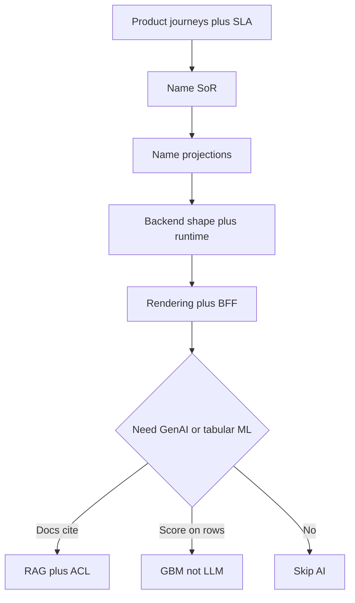

# 07 — Enterprise architectures: real apps (12-year bar)

**Bar:** Technical / Solution / Enterprise Architect. For each product class: **why this shape**, **best DB posture**, **backend**, **frontend**, **AI (practical vs bubble)**, **what you’d refuse**. Steal the **question**, not the logo. Public facts vs **inferred**.

Sister notebooks: [dbnotes 27/31](../dbnotes/31-industry-case-studies/README.md) · [backend 26/30](../backend/30-industry/README.md) · [frontend 27/31](../frontend/31-industry-case-studies/README.md) · [ai 21/22](../ai/22-industry-case-studies/README.md) · [ai PRACTICAL_VS_BUBBLE](../ai/PRACTICAL_VS_BUBBLE.md).

---

## How to answer in 90 seconds

1. Constraints (traffic class, money, SEO, residency, team).  
2. SoR + projections.  
3. One honest deployable story (not 40 services).  
4. AI only if the **job** needs it — pattern + refuse.  
5. Residual risk.

---

## 1. Netflix-class streaming catalog + playback

| Layer | Practical | Bubble to refuse |
|---|---|---|
| **Question** | Read-heavy catalog, HA playback metadata, event fan-out to personalization; **billing is not Cassandra** | “Copy NetflixOSS mesh on day one” |
| **DB** | HA wide-column / KV for viewing-shaped data (**Cassandra**-class); **EVCache**-class for hot keys; **Kafka** → lake (**Iceberg**); **separate** money SoR (relational) | One store for catalog + ledger |
| **Backend** | Many services **because org + release trains**; timeouts, bulkheads, chaos discipline | 1,000 services for a 6-person squad |
| **Frontend** | Device apps + edge; personalization as **projection** | SSR everything |
| **AI** | Recommendations = **ranking / classical + features** (and batch); GenAI trailer blurbs optional | LLM as the recommender SoR |

**Public:** Netflix Tech Blog (Cassandra, EVCache, Kafka, data platform).  
**90s:** “I’d steal HA + cache + event log for **playback-shaped** data. Money stays relational. I would not import their service count.”

---

## 2. LinkedIn-class feed + graph + search

| Layer | Practical | Bubble |
|---|---|---|
| **Question** | Many consumers need the **same fact replayed**; feed is a **projection**; search is relevance | Kafka as the profile SoR |
| **DB** | MySQL/Espresso-class OLTP; **Kafka** log; **Pinot**/warehouse for analytics; search index as projection | Neo4j as Facebook-scale SoR (Meta used MySQL+TAO) |
| **Backend** | Event-driven integration; rest.li-class contracts | Dual-write to search |
| **Frontend** | Feed CSR; infinite scroll; CWV budgets | |
| **AI** | Ranking models; GenAI “rewrite headline” is **prompt**, not SoR | RAG over all member PII without ACL |

**Public:** LinkedIn Engineering (Kafka origin, Pinot, Venice).  
**90s:** “Log for fan-out; OLTP for profile truth; search/feed rebuildable.”

---

## 3. Amazon / Shopify-class commerce

| Layer | Practical | Bubble |
|---|---|---|
| **Question** | Cart/session latency vs **order invariants**; flash sales; catalog search | Everything DynamoDB |
| **DB** | KV/session for cart-shaped (**Dynamo**-class) **or** SQL if numbers allow; **Aurora/MySQL+Vitess** for orders; **S3** blobs; **OpenSearch** catalog projection | Search as inventory SoR |
| **Backend** | Checkout modular monolith or few services; **idempotent** payment; outbox → search/email | Saga fashion without outbox |
| **Frontend** | SSR/ISR PDP; CSR checkout; BFF; CWV = revenue | MFE for one squad |
| **AI** | “Similar items” = retrieval/rank; support RAG on **policy** docs; **not** LLM for stock count | Cosine as stock |

**Public:** Dynamo paper; Shopify Vitess/MySQL; Stripe idempotency talks.  
**90s:** “Access-pattern KV where it fits; money and orders stay strongly consistent SQL; search is a projection.”

---

## 4. Zerodha-class brokerage (India)

| Layer | Practical | Bubble |
|---|---|---|
| **Question** | Latency to exchange, correctness of money, **ops simplicity**, residency | Netflix stack |
| **DB** | **PostgreSQL** SoR; **Redis** for hot market/session **projection**; careful WAL/HA | Cassandra “because scale” at retail QPS |
| **Backend** | Go/Java near the wire; few services; boring deploys | Mesh day one |
| **Frontend** | CSR trading UI; websockets for ticks; **not** Web Push for fills alone | |
| **AI** | Optional research RAG on **public** docs; **never** LLM for order placement | Agent that “buys when confident” |

**Public-ish:** zerodha.tech — Postgres-first simplicity.  
**90s:** “I’d keep Postgres as ledger, Redis disposable, AI read-only. Steal simplicity, not FAANG logos.”

---

## 5. Stripe-class payments API

| Layer | Practical | Bubble |
|---|---|---|
| **Question** | Idempotency, versioning, online DDL, audit | Event-sourcing everything |
| **DB** | Boring OLTP; append-only audit; careful migrations (gh-ost-class) | Redis as money |
| **Backend** | API as product; idempotency keys; strong AuthN | ChatOps refunds without maker-checker |
| **Frontend** | Dashboard CSR + BFF; PCI fields never in SPA logs | |
| **AI** | Support RAG on **docs**; dispute **assist** with human; no autonomous capture | |

**90s:** “Money path is boring SQL + idempotency. AI is assistive with audit.”

---

## 6. ChatGPT / Claude-class assistant (inferred product shape)

| Layer | Practical | Bubble |
|---|---|---|
| **Question** | GPU/model product + **conversation SoR** + optional retrieval | “AI database” |
| **DB** | OLTP for users/threads/usage; blob for files; vector/search **projection**; Redis limits | Pinecone as chat history / billing |
| **Backend** | BFF streams; keys server-side; workers embed | LLM from browser |
| **Frontend** | SSE stream; stop; citations if RAG | Vendor key in SPA |
| **AI** | Prompt + tools allowlist; RAG with ACL; eval gold; DSR erases embeddings | Fine-tune weekly PDFs instead of RAG |

**Public:** vendor product/API docs. **Inferred:** OLTP threads — OpenAI does not publish your ERD.  
**90s:** “Model is a component. Threads in Postgres. Vector rebuildable. Cite or refuse.”

---

## 7. Microsoft 365 Copilot-class (tenant grounding)

| Layer | Practical | Bubble |
|---|---|---|
| **Question** | Ground answers in **tenant Graph** under **Entra** identity | Naked LLM over a shared index |
| **DB / content** | M365 content + Graph is the corpus; your app still has its own SoR for tickets | Copy Copilot SKUs into claims |
| **Backend** | On-behalf-of, least privilege, audit | Forward user token to random SaaS |
| **AI** | Retrieval + cite under **tenant ACL**; DLP | |

**Public:** Microsoft Copilot / Graph architecture blogs.  
**90s:** “Identity + ACL is the product. I’d mirror that for internal RAG, not paste Bing.”

---

## 8. Insurance claims / FNOL (enterprise India / SI)

| Layer | Practical | Bubble |
|---|---|---|
| **Question** | Double-pay Sev-1; storm burst; adjuster search; docs | Microservice per entity |
| **DB** | Claims **OLTP SoR**; object store docs; search **projection**; warehouse for MI | Kafka as claim ledger |
| **Backend** | Modular monolith (policy+claims); outbox; saga only at payment rail | Node OCR on event loop |
| **Frontend** | CSR workspace + BFF; WCAG; SSR only marketing | |
| **AI** | RAG on **policy wordings** with citations; classify FNOL text; **human** on reserve/pay; classical ML for fraud score | Agent auto-settles; vector as claim SoR |

**90s:** “Ledger in SQL, search rebuildable, RAG cites policy or refuses, money has a human.”

---

## 9. HR leave / attendance

| Layer | Practical | Bubble |
|---|---|---|
| **Question** | No double-approve; calendar overlap; notify | Event-sourcing leave |
| **DB** | Postgres; exclusion/unique for overlap; Redis notify fan-out | |
| **Backend** | One deployable; outbox → email/push | |
| **Frontend** | CSR; optimistic UI with server authority | |
| **AI** | Optional FAQ RAG on policy PDF; **not** LLM for balance | |

---

## 10. Internal enterprise RAG (policies / runbooks)

| Layer | Practical | Bubble |
|---|---|---|
| **Question** | Cite paragraph; tenant/ACL; DPDP erase | “ChatGPT for the company” with one global index |
| **DB** | Files SoR (CMS/blob); chunks+embeddings projection; threads OLTP | |
| **Backend** | Go/Java embed workers; Java/Node API; BFF SSE | |
| **Frontend** | Citations as links; refuse empty | |
| **AI** | Hybrid retrieve; fail closed; eval gold; Bedrock **or** Azure OpenAI from **estate** | Multi-cloud LLM for strategy; MCP `run_sql` |

---

## 11. Mobile app (React Native / Android / iOS)

| Layer | Practical | Bubble |
|---|---|---|
| **Question** | Store binary? Camera/offline core? One JS team or two native teams? | “RN = free React” |
| **Client** | PWA if URL enough; **RN** for store+JS team; **Kotlin/Swift** for platform depth | Capacitor to hide a slow web app |
| **API** | Mobile BFF; coarse DTOs; idempotent sync | Chatty per-widget REST |
| **Push** | FCM + APNs; inbox SoR on server | WebSocket when app is killed |
| **Auth** | OIDC PKCE; refresh in Keychain/Keystore | AsyncStorage forever |
| **DB on device** | SQLite/outbox = **cache**, not money SoR | Dual-write without conflict ADR |

**Chapter:** [frontend 40](../frontend/40-react-native-android-ios/README.md) · [interview 10](10-mobile.md).

---

## Practical vs bubble (cross-cutting)

| Bubble | Practical (12y) |
|---|---|
| Data mesh / fabric / “AI-ready lake” as SoR | Named SoR + contracts; lake is SoI |
| Microservices / MFE by default | Split when **org + data** already split |
| Multi-cloud active-active everywhere | One primary estate; DR story honest |
| LLM replaces fraud/credit models | GBM + features; LLM explains |
| Vector DB / Kafka / Redis as money | OLTP ledger |
| Copy Netflix / Uber / ChatGPT SKUs | Copy **constraints**, then shrink |

---

## Books / docs to cite in ARB

| Topic | Cite |
|---|---|
| SoR, logs, replication | Kleppmann *DDIA* |
| Stability | Nygard *Release It!* |
| Integration | Hohpe *EIP* |
| Microservices patterns | Richardson *Microservices Patterns* |
| Frontend rendering | web.dev *Rendering on the Web* |
| RAG | Lewis et al. [arXiv:2005.11401](https://arxiv.org/abs/2005.11401) |
| LLM security | [OWASP LLM Top 10](https://owasp.org/www-project-top-10-for-large-language-model-applications/) |
| Industry | Netflix / LinkedIn / Uber eng blogs; zerodha.tech |

**Next:** [09 AI interview Q&A](09-ai.md) · [04 AWS vs Azure](04-aws-azure.md) · notebooks industry chapters.
